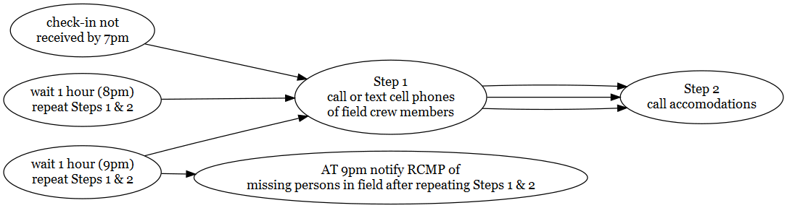

{.logo}

<br>

::: from
Mateo Winterscheidt\
New Graph Environment\
[mateo\@newgraphenvironment](mailto:mateo@newgraphenvironment){.email}\
672-998-5293\
Date: `r format(Sys.Date(), "%Y-%m-%d")`
:::

```{r setup, include = TRUE, echo =FALSE, message=FALSE, warning=FALSE}
# gitbook_on <- TRUE
gitbook_on <- FALSE  ##we just need turn  this on and off to switch between gitbook and pdf via paged.js


knitr::opts_chunk$set(echo=FALSE, message=FALSE, warning=FALSE, dpi=60, out.width = "100%")
options(scipen=999)
options(knitr.kable.NA = '--') #'--'
options(knitr.kable.NAN = '--')

source('R/packages.R')
source('R/functions.R')

name_project_number <- '2023-054'
name_project_name <- 'salmo-larl'
name_repo <- 'safety_plan_salmo_2023'
name_pdf <- 'safety_plan'
name_project_complete <- paste0(name_project_number, '-', name_project_name)

link_repo <- paste0('https://mateo9569.github.io/', name_repo, '/')
link_kml <- paste0('https://github.com/Mateo9569/', name_repo, '/raw/main/mapping/sites_', name_project_name, '_', format(Sys.Date(), '%Y%m%d'), '_kml_gpx.zip')
link_pdf <- paste0('https://github.com/Mateo9569/', name_repo, '/raw/main/docs/', name_pdf, '_', name_project_name, '.pdf')
#link_fieldmaps <- 'https://hillcrestgeo.ca/outgoing/fishpassage/projects/elkr/'


##this is redundant but allows us to keep the gitbook setting for if we move to a better TOC
font_set <- 9


vehicle1 <- '2013 Toyota Tundra black'
```

<br>

# `r paste0('Safety Plan - ',name_project_complete)` {.unnumbered .break-after-me}

The latest version of this pdf can be downloaded [here](https://github.com/Mateo9569/safety_plan_salmo_2022/raw/main/docs/safety_plan_salmo-larl.pdf).

A kml file containing the location of site 1 at the end of Carney Mill Road in Salmo where we are going to carry out a snorkel survey can be downloaded [here](https://github.com/Mateo9569/safety_plan_salmo_2022/raw/main/mapping/Carney.kmz). Site 2 in Salmo can be seen on this orthomosaic map that can be accessed [here](https://www.mapsmadeeasy.com/maps/public/d67c01a499be4c30b7d1c74b72a4101b). A table with site descriptions and locations is found below.

```{r site-details}

site_details <- read.csv('data/site_details.csv')

site_details %>% 
  kable(caption = 'Site Locations') %>% 
  kableExtra::kable_styling(c("condensed", "responsive"),
                              full_width = T,
                              font_size = font_set)
```

**Vehicles**

Al and Mateo - `r vehicle1`


```{r info-hospitals}
hospital_name <- 'Kootenay Lake Hospital'
hospital_phone <- '250-352-3111'
hospital_address <- '3 View St, Nelson, BC V1L 2V1'

hospital_name2 <- 'Kootenay Boundary Regional Hospital'
hospital_phone2 <- '250-368-3311'
hospital_address2 <- '1200 Hospital Bench, Trail, BC V1R 4M1'

```

```{r settings-gitbook, eval= gitbook_on}
photo_width <- "100%"
font_set <- 11

```

```{r settings-paged-html, eval= identical(gitbook_on, FALSE)}
photo_width <- "80%"
font_set <- 9
```

```{r import-projects}
##Read in the contacts spreadsheet
####--------------bring in the equipment list and crew info-----------------
projects <-  readxl::excel_sheets(path = "../onboarding/data/template_contacts_safetylog.xlsx") %>%
  purrr::set_names() %>%
  purrr::map(read_excel,
             path = "../onboarding/data/template_contacts_safetylog.xlsx",
             .name_repair = janitor::make_clean_names) %>%
  purrr::set_names(janitor::make_clean_names(names(.))) %>%
  purrr::map(at_trim_xlsheet) %>% #this is the clean run of this function
  purrr::map(plyr::colwise(type.convert))

```

```{r  tab-overview, eval= F}
# turned eval = off!!!!
tab_overview <- projects %>% 
  pluck('projects') %>% 
  filter(project_number == name_project_number) %>% 
  select(project_number, project_name)

tab_overview %>% 
  kable() %>% 
  kableExtra::kable_styling(c("condensed", "responsive"),
                              full_width = T,
                              font_size = font_set)
```

<br>

```{r tab-crew}
crew_ids <- c('airvine', 
              'mwinterscheidt')


tab_crew <- projects %>% 
  pluck('crew_contacts')  %>% 
  filter(id %in% crew_ids) %>% 
  select(-id) %>% 
  purrr::set_names(nm = names(.) %>% stringr::str_replace_all('crew_', ''))


tab_crew %>% 
  kable(caption = 'Crew members details and emergency contacts') %>% 
  kableExtra::kable_styling(c("condensed", "responsive"),
                              full_width = T,
                              font_size = font_set)
```

# Equipment Checklists {.unnumbered}

```{r table-equipment}

#https://stackoverflow.com/questions/63643051/r-dplyr-filter-string-condition-on-multiple-columns

##equipment personal 
tab_eq_pers <- projects %>% 
  pluck('equipment') %>% 
  filter(!is.na(eq_pers_standard)) %>% 
  arrange(eq_safety) %>% ##have these first on the list
  select(eq_item)  %>% 
  make_untidy_table() %>% 
  rename(`Personal Equipment Checklist` = eq_item)

my_caption = 'Personal Equipment Checklist'

# tab_eq_pers %>% 
#     kable(caption = my_caption, booktabs = T) %>%
#   kableExtra::kable_styling(c("condensed"),
#                             full_width = T,
#                             font_size = font_set)
tab_eq_pers %>% 
  kable() %>% 
  kableExtra::kable_styling(c("condensed", "responsive"),
                              full_width = T,
                              font_size = font_set)
  


```

<br>

```{r equip_crew}
##equipment for the crew
tab_eq_crew <- projects %>% 
  pluck('equipment') %>% 
  # mutate(across(everything(), as.character)) %>% 
  filter(if_any(starts_with('eq_task'), ~ . == 'fish passage')) %>% 
  filter(is.na(eq_pers_standard)) %>% 
  arrange(eq_safety) %>% 
  select(eq_item)  %>% 
  make_untidy_table() %>% 
  rename(`Crew Equipment Checklist` = eq_item)

my_caption = 'Crew Equipment Checklist'

tab_eq_crew %>% 
  kable() %>% 
  kableExtra::kable_styling(c("condensed", "responsive"),
                              full_width = T,
                              font_size = font_set)

```

<br>

### Nearest Hospitals {.unnumbered}

```{r hospital-1, fig.cap=my_caption, fig.width=6}
my_caption = paste(hospital_name, hospital_address, hospital_phone, sep = ' - ')

##register google key defined in 'R/private_info.R' file
ggmap::register_google(key = Sys.getenv('GOOG_API_KEY'))

#define the area of the base map by using a bounding box 
mybasemap <- ggmap::get_map(location = hospital_address,
                     source = "google",
                     zoom = 15,
                    maptype = "roadmap")  

ggmap::ggmap(mybasemap)
  # geom_point(data = geocode(hospital_address), 
  #            aes(x = lon, y = lat, colour = "black", stroke = 10), #https://stackoverflow.com/questions/54803891/custom-shape-in-ggplot-geom-point
  #            show.legend = F)

#knitr::asis_output(paste(hospital_name, hospital_address, hospital_phone, sep = ' - '))   
```

<br>

```{r hospital2, fig.cap=my_caption, fig.width=6, eval = T}
my_caption = paste(hospital_name2, hospital_address2, hospital_phone2, sep = ' - ')

#define the area of the base map by using a bounding box 
mybasemap <- ggmap::get_map(location = hospital_address2,
                     source = "google",
                     zoom = 16,
                    maptype = "roadmap")  

ggmap::ggmap(mybasemap)
  # geom_point(data = geocode(hospital_address), 
  #            aes(x = lon, y = lat, colour = "black", stroke = 10), #https://stackoverflow.com/questions/54803891/custom-shape-in-ggplot-geom-point
  #            show.legend = F)

#knitr::asis_output(paste(hospital_name2, hospital_address2, hospital_phone2, sep = ' - ')) 
```

<br>

## Field Plan {.unnumbered}

The primary goals of what we are doing in this project include:

* snorkel survey to determine fish distribution and density
* UAV survey to map fish habitat

General Field work methods will generally follow procedures in:

-   [fish passage assessments](https://www2.gov.bc.ca/assets/gov/environment/natural-resource-stewardship/land-based-investment/forests-for-tomorrow/field-assessment-for-determining-fish-passage-status-of-cbs.pdf) [@fish_passage_assessments]

-   [habitat confirmations](https://www2.gov.bc.ca/assets/gov/environment/natural-resource-stewardship/land-based-investment/forests-for-tomorrow/checklist-for-fish-habitat-confirmation-201112.pdf) [@confirmation_checklist_2011].

<br>

Presence/absence of fish, species composition/density and distribution limits can be useful for prioritizing which crossings are a best fit for fish passage restoration and help inform follow up monitoring so electrofishing and minnowtrapping may be conducted. Standard Fish and Fish Habitat Inventory Standard Field Form [site cards](https://www2.gov.bc.ca/gov/content/environment/natural-resource-stewardship/laws-policies-standards-guidance/inventory-standards/aquatic-ecosystems) are used to gather habitat data. Field guide is [here](https://www2.gov.bc.ca/assets/gov/environment/natural-resource-stewardship/nr-laws-policy/risc/sitecard20.pdf)

<br>

We are running digital field form tests using a product called [Mergin Maps](https://merginmaps.com/?gclid=Cj0KCQjwxb2XBhDBARIsAOjDZ34oq-iMid3vRrgK1ZAkJ_yiz4aWY-LLF90PHiXzELbZIrxooV9vWKYaAgl2EALw_wcB) which syncs with QGIS. Crews can access projects with a free account. Please send me your usernames and we can begin to share projects/forms.

<br>

A guide to freshwater fish id such as @mcphail_carveth1993FieldKey can be useful and can be downloaded [here](https://a100.gov.bc.ca/pub/acat/documents/r13659/486FieldKeytoFreshwaterFishes1993Part1of2_1210014849226_8e248a8d30d97e6c45ef54a340babd2ffb57b14a3b16.pdf).


<!-- and an overview map of displaying potential sample locations is included as Figure 1. -->

<br>

### Check In Procedures {-}

Call, text or inreach Tara Stark (2505059854) in the morning to share the plan for the day (i.e. name of roads and sites). Check in time is before 7 pm each evening although we regularly check in throughout the day (ex. at arrival to site, 1pm and 4pm) on the inreach or by text and report position/provide updates.

<br>

#### Procedures for Failed Check-In - for Check in person {-}

<br>

Procedures are summarized in the following Figure. If phone call or inReach check-in is not received by 7pm send text to inreach units, call or text cell phones of field crew members. If no response please call accommodations then personal emergency contacts to see if they have heard anything. Wait 1 hour and text inreach, text or call cell phones and personal emergency contacts and accomodations again. Repeat after 2 hours (9 pm) - if no response then notify the RCMP of a missing persons in field.

<br>

```{r flow-check-in-fail, fig.cap= 'Procedures for failed check-in', eval=T}
#  Not sure why this doesn't work yet
DiagrammeR::grViz("digraph rmarkdown{
  
graph[layout = dot, rankdir = LR]

d1 [label = 'check-in not \n received by 7pm']
d2 [label = 'Step 1 \n call or text cell phones \n of field crew members']
d3 [label = 'Step 2 \n call accomodations']
d4 [label = 'wait 1 hour (8pm) \n repeat Steps 1 & 2']
d5 [label = 'wait 1 hour (9pm) \n repeat Steps 1 & 2']
d6 [label = 'AT 9pm notify RCMP of \n missing persons in field after repeating Steps 1 & 2']


d1 -> d2 -> d3 
d4 -> d2 -> d3 
d5 -> d2 -> d3 
d5 -> d6
}") %>% 
  DiagrammeRsvg::export_svg() %>% 
  charToRaw %>%
  rsvg::rsvg_png("fig/flow-check-in-fail.png")
  
  


```

<!-- `r if(gitbook_on){knitr::asis_output("<br>")} else knitr::asis_output("<br><br><br><br><br><br><br>")` -->

```{r map-prep, eval=F}
##register google key defined in 'R/private_info.R' file
ggmap::register_google(key = Sys.getenv('GOOG_API_KEY'))

#define the area of the base map by using a bounding box 
mybasemap <- ggmap::get_map(location = c(left = table_sites %>% pull(long) %>% min()-0.01, 
                                    bottom = table_sites %>% pull(lat) %>% min()-0.01,
                                    right = table_sites %>% pull(long) %>% max()+0.01,
                                    top = table_sites %>% pull(lat) %>% max()+0.01),
                     source = "google",
                     zoom = 8,
                    maptype = "hybrid")


#define the area of the base map by using the middle. 
# mybasemap <- ggmap::get_map(location = c(lon = table_sites %>% pull(long) %>% mean(),
#                                          lat = table_sites %>% pull(lat) %>% mean())
#                             source = "google",
#                             zoom = "auto",
#                             maptype = "hybrid")


mymap <- ggmap::ggmap(mybasemap) + 
  geom_point(data = table_sites, 
             aes(x = long, y = lat, colour = color),
             show.legend = F)
  # ggsflabel::geom_sf_label(data = table_sites, 
  #                          aes(x = long, y = lat, label = name),
  #                          force = 100, 
  #                          nudge_x = -2)

mymap

# Figure 1. Map of potential sampling areas. High priority sites in red and moderate priority in green.
```

`r if(gitbook_on){knitr::asis_output("<br>")} else knitr::asis_output("<br><br><br><br><br><br><br><br><br><br><br><br><br><br><br><br>")`

# References {.unnumbered}
